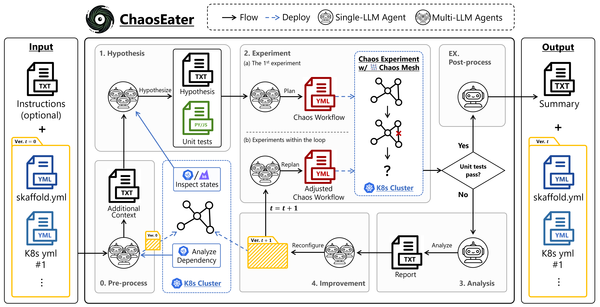
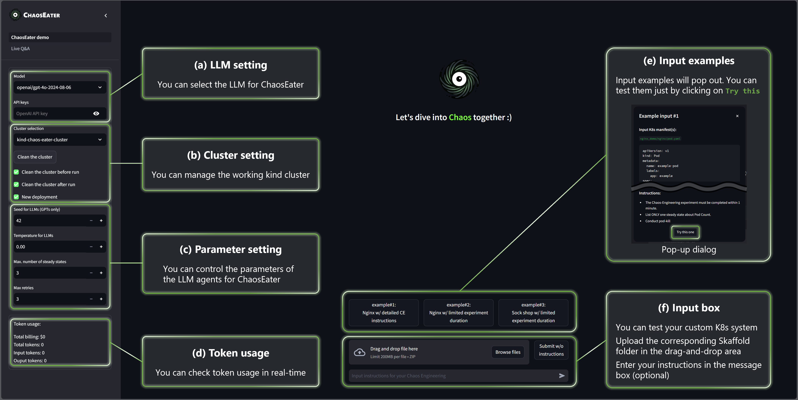

#  ChaosEater: Fully Automating Chaos Engineering with Large Language Models 

<p align="center">
  <a href="https://ntt-dkiku.github.io/chaos-eater/" target="_blank"></a>
  <a href="https://arxiv.org/abs/2501.11107" target="_blank"></a>
  <a href="https://huggingface.co/spaces/oookiku/chaos-eater" target="_blank"></a>
</p>

<p>
  This repo is the official implementation of "<a href="https://arxiv.org/abs/2501.11107" target="_blank">ChaosEater: Fully Automating Chaos Engineering with Large Language Models</a>" (arXiv preprint).
  ChaosEater is an LLM-based system for FULLY automating the Chaos Engineering (CE) cycle in Kubernetes clusters.
  Systematically, the CE cycle consists of four phases: hypothesis, experiment, analysis, and improvement.
  ChaosEater pre-defines its general workflow (i.e., agentic workflow) according to the systematic CE cycle and assigns subdivided operations within the workflow into LLM agents.
  The operations assigned to LLM agents include several software engineering tasks, such as requirement definitions, test planning, and debugging.
  See the <a href="https://ntt-dkiku.github.io/chaos-eater/" target="_blank">project page</a> and the <a href="https://arxiv.org/abs/2501.11107" target="_blank">arXiv paper</a> for technical details.
</p>



> [!WARNING]  
> This system is an experimental implementation and is not for product environments.

## 🚀 Quick start
In the following, we assume that Docker has been already installed on your machine.  
FYI: Docker installation guide (official): https://docs.docker.com/engine/install/ubuntu/

We offer two options for building the ChaosEater app.
```Option A``` containerizes both K8s (kind) clusters and the ChaosEater app. 
This allows you to easily try out ChaosEater without modifying the host environment, but please use it only in a security-safe environment.
In ```Option B```, K8s (kind) clusters and the ChaosEater app's Docker container are built directly on the host.

For developers who want to edit the codebase and check the app's behavior, we also offer a development mode ```Option A-dev```.

<details>
<summary>
  Option A: kind-in-dind sandbox 🌟Recomended for local users🌟
</summary>

<br>

Here, we describe how to containerize both K8s (kind) clusters and the ChaosEater app. 
If you want to check the app's behavior while modifying the codebase, try ```Opiton A-dev: Developement mode```.

> **⚠️WARNING**    
> This option uses privileged mode, so it should only be used on your local machine or a securely isolated cloud environment.

### 0. Clone this repository
Clone this repository and move there.
```
git clone https://github.com/ntt-dkiku/chaos-eater.git && cd chaos-eater 
```

### 1. Build the sanbox image
```
docker build -f docker/Dockerfile_sandbox -t chaos-eater/kind-in-dind-sandbox:0.1 .
```

### 2. Launch the container
```
docker run --rm \
           --name chaos-eater \
           --privileged \
           -d \
           -p <port>:<port> \
           -p 2333:2333 \
           chaos-eater/kind-in-dind-sandbox:0.1
docker exec -it chaos-eater bash -c "
    /usr/local/bin/entrypoint.sh -p <port> \
                                 --openai-key <your-openai-api-key> \
                                 --anthropic-key <your-anthropic-api-key> \
                                 --google-key <your-gemini-api-key>"
```

### 3. Access the ChaosEater WebGUI
Access ```localhost:<port>``` in your browser. Now, you can try the ChaosEater GUI in your browser!  
If you are working on a remote server, don't forget to set up port forwarding, e.g., ```ssh <remote-server-name> -L <port>:localhost:<port>```.
</details>


<details>
<summary>
  Option A-dev: Development mode 🌟Recomended for developers🌟
</summary>

<br>

In ```Option A```, the application codebase is copied to the Docker image when building it. Then, the application is launched based on the copied codebase when running the container.
In other words, the application codebase is fixed to its state at the time of the Docker image build.

On the other hand, you may want to modify the codebase interactively while verifying its behavior.
To achieve this, you should mount a Docker volume to your working directory on the host, and manually launch the Streamlit app within the ChaosEater's container running in dind. 
The following section describes the process step by step.

### 0. Clone this repository (same as ```Option A```)
Clone this repository and move there.
```
git clone https://github.com/ntt-dkiku/chaos-eater.git && cd chaos-eater 
```

### 1. Build the sandbox image (same as ```Option A```)
```
docker build -f docker/Dockerfile_sandbox -t chaos-eater/kind-in-dind-sandbox:0.1 .
```

### 2. Launch the dind container in development mode
```
docker run --rm \
           --name chaos-eater-dev \
           --privileged \
           -d \
           -p <port>:<port> \
           -p 2333:2333 \
           -v <path-to-this-repo>:/workspace \
           chaos-eater/kind-in-dind-sandbox:0.1
docker exec -it chaos-eater-dev bash -c "
    /usr/local/bin/entrypoint.sh --develop \
                                 --openai-key <your-openai-api-key> \
                                 --anthropic-key <your-anthropic-api-key> \
                                 --google-key <your-gemini-api-key>"
```

### 3. Enter the ChaosEater's container running in dind
Enter the dind container.
```
docker exec -it chaos-eater-dev bash
```
You are now within the dind container and should be able to find the ChaosEater's container.
Check it by the following command.
```
docker ps
```
The return should be like:
```
CONTAINER ID   IMAGE                         COMMAND                  CREATED      STATUS      PORTS                       NAMES
3a7044477faf   chaos-eater/chaos-eater:1.0   "bash -c 'redis-serv…"   2 days ago   Up 2 days                               chaos-eater
64b315ace43c   kindest/node:v1.30.0          "/usr/local/bin/entr…"   2 days ago   Up 2 days   127.0.0.1:41641->6443/tcp   chaos-eater-cluster-control-plane
```
If there are no problems, enter the ChaosEater's container.
```
docker exec -it chaos-eater bash
``` 

### 4. Launch the streamlit app manually
Within the ChaosEater's container, move to the mounted working directory.
```
cd /workspace
```
Launch the streamlit app by yourself.
```
streamlit run ChaosEater_demo.py --server.port <port> --server.fileWatcherType none
```
Now, you can modify the codebase interactively while verifying its behavior.
Every time you modify the codebase on the host, you need to stop the Streamlit app using ```Ctrl + C``` and relaunch it to apply the changes.
</details>


<details>
<summary>
  Option B: Standard kind cluster
</summary>

<br>

Here, we describe how to build K8s (kind) clusters and the ChaosEater app's Docker container on the host.
### 0. Clone this repository
Clone this repository and move there.
```
git clone https://github.com/ntt-dkiku/chaos-eater.git && cd chaos-eater 
```
### 1. Install environment
Install dependency tools in local using [create_environment.sh](./create_environment.sh). The installed tools include ```kubectl```, ```kind```, ```krew```, ```kubectl-graph```, ```skaffold```. Note that tools that are already installed in local will be skipped.
```
./create_environment.sh
```
### 2. Create a kind cluster and the ChaosEater container
Create a kind cluster and the ChaosEater container using [create_kind_cluster.sh](./create_kind_cluster.sh). You may change the cluster name and the port number of the ChaosEater app with the the ```-n,--name <your-favorite-name>``` and ```-p,--port <port>``` options, respectively.
```
./create_kind_cluster.sh -n chaos-eater-cluster -p <port>
```

### 3. Launch the ChoasEater app
You should now be able to find the ChaosEater container running on your machine.
Check it by the following command.
```
docker ps
```
The return should be like:
```
CONTAINER ID   IMAGE                         COMMAND                  CREATED      STATUS      PORTS                       NAMES
3a7044477faf   chaos-eater/chaos-eater:1.0   "bash -c 'redis-serv…"   2 days ago   Up 2 days                               chaos-eater
64b315ace43c   kindest/node:v1.30.0          "/usr/local/bin/entr…"   2 days ago   Up 2 days   127.0.0.1:41641->6443/tcp   chaos-eater-cluster-control-plane
```
If there are no problems, enter the ChaosEater's container.
```
docker exec -it chaos-eater bash
```
Within the continer, set each API key (```Anthropic```, ```Gemini```, and ```OpenAI``` are supported) and launch the streamlit app of ChaosEater with the appropriate port number.
```
export ANTHROPIC_API_KEY=<your anthropic api key>
export GOOGLE_API_KEY=<your gemini api key>
export OPENAI_API_KEY=<your openai api key>
```
```
streamlit run ChaosEater_demo.py --server.fileWatcherType none --server.port <port>
```

### 4. Access the ChaosEater WebGUI
Access ```localhost:<port>``` in your browser. Now, you can try the ChaosEater GUI in your browser!
If you are working on a remote server, don't forget to set up fort forwarding, e.g., ```ssh <remote-server> -L <port>:localhost:<port>```.  
</details>

## 🕹️ GUI usage


The ChaosEater app provides a Graphical User Interface (GUI) like a chatbot.
At a minimum, all you need to do is upload the K8s system files via the file uploader.
Optionally, you can enter Chaos Engineering instructions in the chat box and control some parameters.  
The details of the GUI controls are as follows.  

<details>
<summary>
(a) LLM setting
</summary>

> **⚠️WARNING**  
> The current ChaosEater supports only GPT-4o (you can use Claude and Gemini, but they cannot complete CE cycles). We plan to add support for Claude and Gemini as soon as possible.

You may change the LLMs used by ChaosEater from the ```model``` dropdown button.
The currently supported LLMs are GPT-4o (```openai/gpt-4o-2024-08-06```, ```openai/gpt-4o-2024-05-13```), Claude (```claude-3-5-sonnet-20240620```), Gemini (```google/gemini-1.5-pro```). 
</details>

<details>
<summary>
(b) Cluster setting
</summary>

Currently available clusters are listed in the ```Cluster selection``` dropdown button.
When there are multiple kind clusters, you may change the working kind cluster from here.
While the GUI browser is open, the selected cluster will be occupied, and other users will not see the same cluster in the dropdown button.

If you check ```Clean the cluster before/after run```, all resources in the selected cluster, excect for ChaosEater's, will be removed before/after running every single CE cycle.

If you check ```New deployment```, the input K8s system will be deployed in the preprocessing phase. If it is already deployed, you may uncheck it to skip the deployment.

</details>

<details>
<summary>
(c) Parameter setting
</summary>

You can control the parameters of the LLM agents for ChaosEater.  
```Seed for LLMs``` sets the random seed for the LLMs (this is only effective when using OpenAI models that support seed setting, such as GPT-4o).  
```Temperature for LLMs``` sets the temperature of the LLMs.  
```Max. number of steady states``` sets the maximum number of steady states proposed during the hypothesis phase.  
```Max retries``` sets the maximum number of iterations for the verification loop and improvement loop. If the loop exceeds this limit, an assertion error will occur, immediately terminating the app at that point.

</details>

<details>
<summary>
(d) Token usage
</summary>

You can monitor token usage in real-time. The total cost is calculated based on the official pricing tables as of September 2024.  
</details>

<details>
<summary>
(e) Input examples
</summary>

We prepare three types of input examples.
When you press each button, the content of the K8s manifests to be input and the instructions will be displayed in a dialog.
Click the ```Try this one``` button for the example you wanna try, and a CE cycle will start for that input example.
</details>

<details>
<summary>
(f) Input box
</summary>

You can try your custom system by inputting its data to the input box.
First, input a zipped folder to the file uploader box following the input format instruction below (this step is mandatory). If you don't have any instructions for the CE cycle, click the ```Submit w/o instructions``` button, and a CE cycle will start for that input system. If you do, write your instructions in the chat box and click the send icon ```▶``` / ```Enter```. Then, a CE cycle that follows the instructions will start for that input system.
</details>

<details>
<summary>
Input format
</summary>

As input, ChaosEater currently supports only a zipped Skaffold project folder, which involves of a Skaffold configuration file and K8s manifests.
The Skaffold configuration file must be placed in the root directory of the folder.
The K8s manifests can be placed anywhere, but ensure that their relative paths are correctly specified in the ```manifests``` section of the Skaffold configuration file.
More specifically, please refer to our example folders: [nginx](./examples/nginx), [sock shop](./examples/sock-shop-2).
</details>

## 💡 Examples (WIP)

### 
<details>
<summary>
  Case A: Ngnix
</summary>

#### System description  
Nginx is a small-scale system that consists of two K8s manifests (i.e., two resources): pod.yaml and service.yaml. The former defines a Pod resource including a Nginx container, and the latter defines Service resource routing TCP traffic to the Pod.
You can find the manifests at [examples/nginx](./examples/nginx).

#### Problem setting 
To verify whether ChaosEater can improve the system when there are resiliency issues, we intentionally configure the resource with a non-resilient setting; we set the Pod's restartPolicy to Never in pod.yaml. With this configuration, once the Pod goes down, it will never restart, resulting in extended service outages. we validate whether ChaosEater correctly identifies and addresses this resiliency issue through a reasonable CE cycle.

#### Results  
Given the Nginx, ChaosEater defined "The Pod should be running at least 90% of the time during the check period" as one of the steady states during the hypothesis phase. It then generated a failure scenario for a cyberattack, where the Pod would go down after a network delay.
In the experiment phase, ChaosEater executed the chaos experiment to validate the steady states and successfully discovered that the Pod had not restarted after its failure.

In the analysis and improvement phases, ChaosEater analyzed the results and identified that the issue was caused by the restartPolicy being set to Never. It then replaced the Pod resource with a Depolyment resource with three replicas.

Finally, ChaosEater re-executed the chaos experiment on the reconfigured Nginx and confirmed that the hypothesis was satisfied.
The cost and time for this CE cycle were approximately 0.21 USD and 11 minutes, respectively.
</details>

<details>
<summary>
  Case B: SockShop
</summary>

#### System description  
SockShop is a practical and large-scale e-commerce system that consists of 29 manifests, which define the resources and databases for front-end pages, user information, order, payment, shipping, and so on. The number of replicas of all the Deployment resources is originally set to one. However, this setting could lead to downtime of the single replica when it goes down.
You can find the manifests at [examples/sock-shop-2](./examples/sock-shop-2).

#### Problem setting  
To narrow down this original resiliency issue to a single point, we increase the replicas for Deployment resources other than front-end-dep.yaml to two, while keeping a single replica for front-end-dep.yaml. This RELATIVELY reduces the redundancy/resiliency of the front-end resource. We validate whether ChaosEater correctly identifies and addresses this resiliency issue through a reasonable CE cycle.

#### Results  
Given the SockShop with adjusted replica counts, ChaosEater defined "front-end resources are always in the Ready state" as one of the steady states during the hypothesis phase. It then generated a failure scenario for a Black Friday sale, where the front-end resource would go down after an increase in CPU usage of the carts-db resource due to excessive access.
In the experiment phase, ChaosEater executed the chaos experiment to validate the steady states and successfully discovered the existence of downtime after the front-end resource failure.

In the analysis and improvement phases, ChaosEater analyzed the results and identified that the downtime was caused by the replica count of the front-end resource being set to 1. It then increased the replica count of the front-end resource to 2.

Finally, ChaosEater re-executed the chaos experiment on the reconfigured SockShop and confirmed that the hypothesis was satisfied.
The cost and time for this CE cycle were approximately 0.84 USD and 25 minutes, respectively.
</details>

<details>
<summary>
  Case C: OnlineBoutique (WIP)
</summary>

Comming soon!
</details>

## 📊 Evaluation (WIP)
> [!WARNING]  
> Note that, due to the nature of the LLMs used, the generated datasets and evaluation results cannot be fully reproduced consistently, even when a seed value is set.
### 0. Data Genrataion
Generate a dataset of synthesis k8s manifests by running [generate_datasets.py](./generate_datasets.py) in the container.
```
python generate_datasets.py
```
### 1. Evaluation
Evaluate ChaosEater on the dataset. Run [evaluate_quantitative_metrics.py](./evaluate_quantitative_metrics.py) and [evaluate_quality_by_reviewer.py](./evaluate_quality_by_reviewer.py) for quantitative and qualitative evalutions, respectively.
```
python evaluate_quantitative_metrics.py
python evaluate_quality_by_reviewer.py
```
### 2. Analysis
Analyze the evaluation results on the Jupyter notebook [analyze_evaluation_result.ipynb](./analyze_evaluation_result.ipynb).

## 🐞 Bug reports and questions
If you encounter bugs or have any questions, please post [issues](https://github.com/ntt-dkiku/chaos-eater/issues) or [discussions](https://github.com/ntt-dkiku/chaos-eater/discussions) in this repo. New feature requests are also welcome.

## 📄 License
Our code is licenced by NTT. Basically, the use of our code is limitted to research purposes. See [LICENSE](./LICENSE) for details.

## 🙌 Acknowledgements
ChaosEater is built upon numerous excellect projects. Big thank you to the following projects! (A-Z):
- [Anthropic API](https://www.anthropic.com/api)
- [Chaos Mesh](https://github.com/chaos-mesh/chaos-mesh)
- [Gemini API](https://ai.google.dev/)
- [Hugging Face + its community](https://huggingface.co/)
- [k6](https://github.com/grafana/k6)
- [kind](https://github.com/kubernetes-sigs/kind)
- [kubectl graph](https://github.com/steveteuber/kubectl-graph)
- [Kubernetes](https://github.com/kubernetes/kubernetes)
- [LangChain](https://github.com/langchain-ai/langchain)
- [OpenAI API](https://openai.com/index/openai-api/)
- [Skaffold](https://github.com/GoogleContainerTools/skaffold)
- [Streamlit](https://github.com/streamlit/streamlit)
- All other related projects

## 🤝 Citations
If you find this work useful, please cite our paper as follows:
```
@misc{dkiku2025chaoseater,
    title={ChaosEater: Fully Automating Chaos Engineering with Large Language Models}, 
    author={Daisuke Kikuta and Hiroki Ikeuchi and Kengo Tajiri and Yuusuke Nakano},
    year={2025},
    eprint={2501.11107},
    archivePrefix={arXiv},
    primaryClass={cs.SE},
    url={https://arxiv.org/abs/2501.11107}, 
}
```
